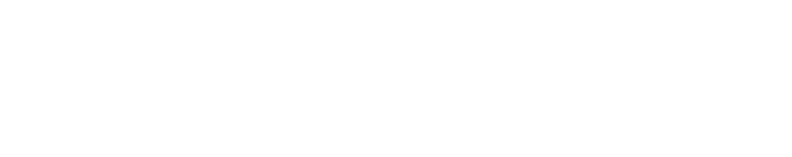

<picture>
  <source media="(prefers-color-scheme: dark)" srcset="https://raw.githubusercontent.com/hackplace-org/.github/main/dark_logo.svg" />
  <source media="(prefers-color-scheme: light)" srcset="https://raw.githubusercontent.com/hackplace-org/.github/main/light_logo.svg" />
  
</picture>

This is the organization for [hack.place()](https://www.hackplace.org). We run programming workshops and hackathons for students within Monmouth County, NJ!

# What's in this organization?

All of the code used by hack.place() is open-sourced here. Feel free to browse our repositories:

- [Our website, hackplace.org](https://github.com/hackplace-org/hackplace.org)
- [Our workshop presentation slides](https://github.com/hackplace-org/presentations)
- The code for our workshops themselves:
  - [Intro to HTML/CSS/JS](https://github.com/hackplace-org/weather-app)
